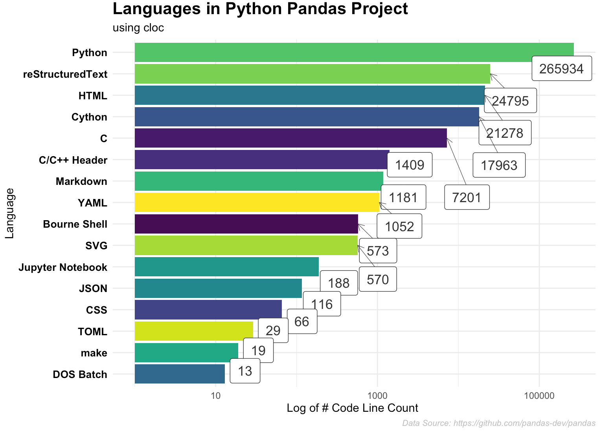

# pandas-cloc
Programming Languages in Pandas Project

Steps to reproduce:

+ Clone [`pandas`](https://github.com/pandas-dev/pandas) in your local machine
+ Make sure you've [cloc](github.com/AlDanial/cloc) installed 
+ Run the below `bash` statement (inside `pandas` directory)

```sh
cloc . --out ~/Downloads/pandas.txt
```
+ Use `pandas.txt` in the `R` script to generate the plot


Raw output of `cloc` 

```
1278 text files.
    1268 unique files.
     156 files ignored.

github.com/AlDanial/cloc v 1.84  T=8.14 s (146.5 files/s, 68483.8 lines/s)
-------------------------------------------------------------------------------
Language                     files          blank        comment           code
-------------------------------------------------------------------------------
Python                         791          75108          79380         265934
reStructuredText               122          19354          21411          24795
HTML                           110           2338            205          21278
Cython                          57           5780           6548          17963
C                                9           1277            955           7201
C/C++ Header                    15            466            616           1409
Markdown                        20            346              0           1181
YAML                            28            111             77           1052
Bourne Shell                    17            172            121            573
SVG                             12              1              4            570
Jupyter Notebook                 1              0           1056            188
JSON                             4             14              0            116
CSS                              1              0              0             66
TOML                             1              1              2             29
make                             1              8              0             19
DOS Batch                        4              4              0             13
-------------------------------------------------------------------------------
SUM:                          1193         104980         110375         342387
-------------------------------------------------------------------------------
```



### Courtesy

+ [cloc](github.com/AlDanial/cloc)
+ [`tidyverse`](https://github.com/tidyverse/)
